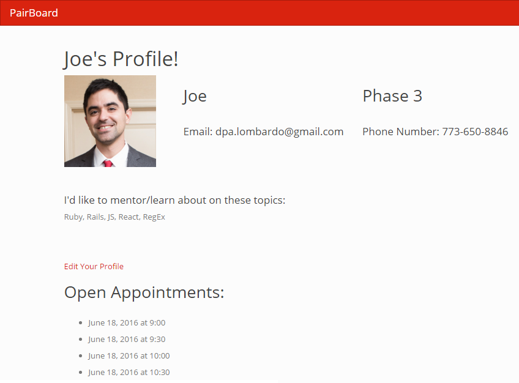
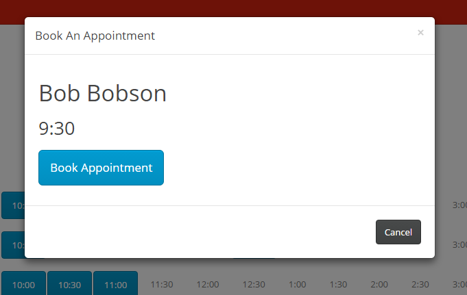
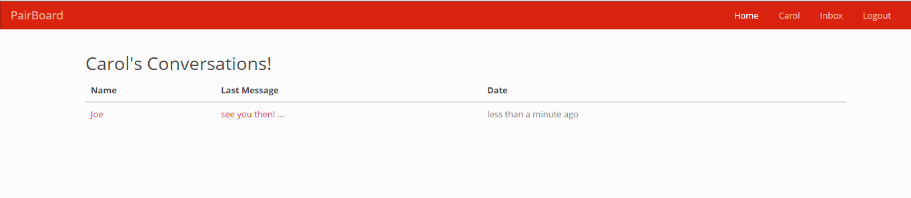
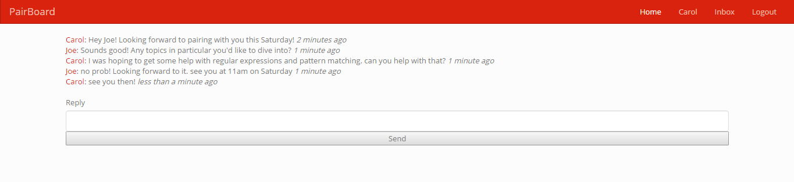

# The Pairing Board

## Purpose
A digital pairing board! This idea was pitched by one of the DBC instructors as a client project. The mission is to give new Dev Bootcamp students a way to connect to experienced DBC students for Saturday mentoring. Currently pairing is accomplished using a white board, it is our goal to replace the physical board with a simple, easy-to-use web application.

## Getting Started
### Register/Login/Account
Users must have an account and be logged in to use Pair Board. Avatars are automatically pulled from Gravatar. Users can update their profile details and avatar from their account page.

### Mentors
Mentors can make offerings on the Pair Board to let students know their availabilities each Saturday. Offerings are made in half-hour increments between the hours of 900 and 1700.

### Students
Students can view offerings and make appointments, with a couple of restrictions. First, students can not make multiple appointments during the same time slot. Second, students can only book a maximum of one hour with a specific mentor per Saturday. This encourages different pairings, allowing students to strengthen connections with other students.  Usage of Pair Board is restricted to DBC students.

### Messaging
Appointments and cancellations will trigger automated messages to both mentors and students, notifying them of the cancellation.

## Dependencies
See Gemfile

## Contributors
* [Elizabeth Alexander](https://github.com/eealexander2)
* [Jonathan Kaplan](https://github.com/jbkaplan)
* [Frank Lam](https://github.com/FTLam11)
* [Dominick Lombardo](https://github.com/lombardo-chcg)
